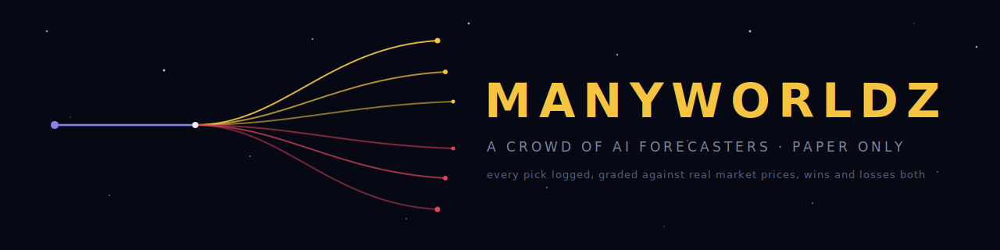
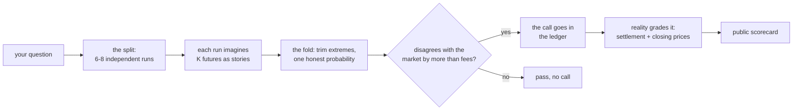

<p align="center">
  
</p>

<h1 align="center">manyworldz</h1>

<p align="center"><i>Simulate every story the future could tell. Keep score against reality.</i></p>

<p align="center">
  
  
  
  
  
</p>

---

In the movie, Doctor Strange goes forward in time and watches **14,000,605 possible futures** to find the one that matters.

manyworldz is that trick, for real questions. Ask it anything with a yes or a no. It splits the question into independent runs, each run **imagines the event playing out as short stories**, and the answer is read off how many of those stories end in YES. Then reality grades every answer, in public, wins and losses both.

## ✨ What it does

- **Ask it anything**: give it `"Will the Fed cut rates in September?"` and the engine splits into six to eight independent runs; each pulls fresh headlines, anchors on a base rate, and imagines the event playing out several different ways
- **Every story seen**: a run's probability is how many of its imagined futures land YES; the final answer is the fold of all the worlds
- **What-if mode**: force one fact to be true (`"the star player is out tonight"`) and watch how far every future shifts
- **Live loop**: scans ~4,000 open Kalshi markets, and when the crowd of futures disagrees with the market price by more than fees could explain, it logs the call
- **The scorecard**: every call is graded against real closing prices. The ledger is public. It cannot show a rosier number than reality

## 🔮 See the stories

```
$ venv/bin/python ask.py "Will the Fed cut rates in September?"

Q: Will the Fed cut rates in September?

  THE CROWD SAYS: 72% chance of YES
  (disagreement spread 0.08, 0 unusable answers skipped)

    81%  Ava    three straight soft inflation prints
    74%  Finn   every headline this week leans toward a cut
    72%  Luna   informed money moved to YES overnight
    70%  Kai    a fair line here feels like the low 70s
    68%  Iris   two voting members signaled comfort with easing
    55%  Mo     everyone is sure, which is exactly what worries me

  FUTURES THE CROWD SAW:
   + The Fed reads three cooling prints and cuts 25bps  (Ava)
   + Powell hints at Jackson Hole first, then delivers  (Luna)
   - A hot jobs report freezes the committee one more meeting  (Mo)
```

Every `+` and `-` line is one imagined future: a tiny story with an ending. The odds are just the census of the stories. (The format above is exact; the numbers are invented. Run it with your own key for real ones.)

Add `--whatif "some fact"` to re-run every world with that fact forced true and see how far the odds move. Add `--vote` for a cheaper single-number mode with no stories.

Add `--deep` to go further: instead of a fixed batch of futures, it keeps splitting into more of them, round after round. Each new batch gets checked against every world already found, and stories that describe the same mechanism get folded together and counted, not repeated. It keeps splitting until two rounds in a row find nothing new, then shows the map of every distinct world it saw, ranked by how often each one came up. The odds are still the plain count across every future it ever imagined, duplicates included: the map is just for reading, not for the math.

## 🌌 How it works



1. `adapters/kalshi_events.py` turns open markets into simple cards; `engine/news.py` pulls fresh headlines, no key needed
2. `engine/swarm.py` runs the split, throws out junk answers (never invents one), trims the extremes, and returns one probability plus a disagreement spread
3. `run.py` compares the crowd's number to the market price; a real gap becomes a logged call in `data/ledger.csv`
4. Next cycle, `ledger.py` re-grades every open call: did the market move toward us, did it settle, did we win
5. `report.py` writes the dashboard data; the site draws straight from the same ledger the grading reads

## 🚀 Set it up

Five minutes from clone to first answer:

```bash
# 1. get the code
git clone https://github.com/akadigari/manyworldz && cd manyworldz

# 2. install (one venv, five small libraries)
python3 -m venv venv && venv/bin/pip install -r requirements.txt

# 3. add your Anthropic key (console.anthropic.com)
export ANTHROPIC_API_KEY=your-key

# 4. ask the worlds something
venv/bin/python ask.py "Will it snow in DC this December?"

# 5. or run one full live cycle on real markets
venv/bin/python run.py
```

A question costs about a cent on the default model, and answers are cached, so asking twice is free. Prefer Docker? `docker build -t manyworldz .` then `docker run -e ANTHROPIC_API_KEY=your-key manyworldz`.

**Requirements:** Python 3.11+ and an Anthropic API key (only for asking; the market scan and dashboard need none). 80 tests, all offline: `venv/bin/pytest` runs green with no key and no network.

## 🧠 Pick the crowd's brain

| Name | Model | Cost |
|---|---|---|
| `haiku` | claude-haiku-4-5 | about 1 cent per question (default) |
| `sonnet` | claude-sonnet-5 | ~3x |
| `opus` | claude-opus-4-8 | ~5x |
| `fable` | claude-fable-5 | ~10x |

Set it with `--model` or the `MANYWORLDZ_MODEL` env var; any full model ID works too. There is a hard budget cap (`ENGINE_BUDGET_USD` in `config.py`, default $10): when it's spent, the engine stops asking. No surprises.

## 🗺️ Things worth asking

Fed days and CPI prints. Elections and confirmations. Album drops, box office, award night. Ceasefires and summits. Whether your flight boards on time Friday. If it resolves yes or no, the worlds will split for it.

## 📏 The rules it can't break

- **It never bets.** There is no order-placing code path in this repo. A person makes any real decision, and only if the pre-registered gates pass (`GATES.md`, written before any results existed: beat the closing line, beat a boring baseline, survive a luck test, survive fees)
- Junk answers get skipped and counted, never fabricated; an all-junk crowd means no call at all
- Questions with no market price are told so honestly, the crowd never gets a fake anchor
- The dashboard reads the exact same ledger the gates read

## ☁️ Run it in the cloud

`.github/workflows/manyworldz.yml` runs the live loop four times a day on GitHub Actions and commits the scorecard back. Setup: add `ANTHROPIC_API_KEY` as a repository secret (Settings, then Secrets and variables, then Actions). Done. The laptop can stay off.

Not your repo? **Fork it**, add your own key as the secret, and GitHub runs your own copy of the crowd four times a day on the free tier, building your own ledger. Every fork is its own little forecasting station.

## 🗂️ Structure

```
ask.py            ask the worlds anything (CLI)
run.py            one live cycle: grade -> split -> log calls
engine/           llm client (cached, budget-capped), swarm, simulate
                  mode, what-if, news research
adapters/         kalshi market cards (+ a dormant NBA backtest lab)
ledger.py         the scorecard: calls, CLV, settlement
report.py         ledger -> web/data.json + REPORT.md
web/index.html    the dashboard (static, no server): branching-worlds
                  map, ask-the-worlds in your browser, the receipts
GATES.md          pre-registered pass/fail rules
docs/             architecture + a plain-English tour
```

## 📜 License

MIT. Wins and losses both get published.

*One more thing: the engine's random seed is `14000605`. If you know, you know.*
