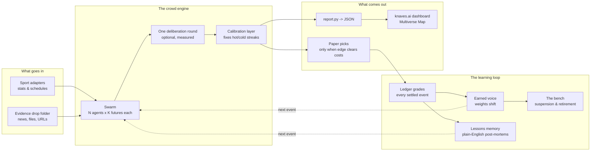
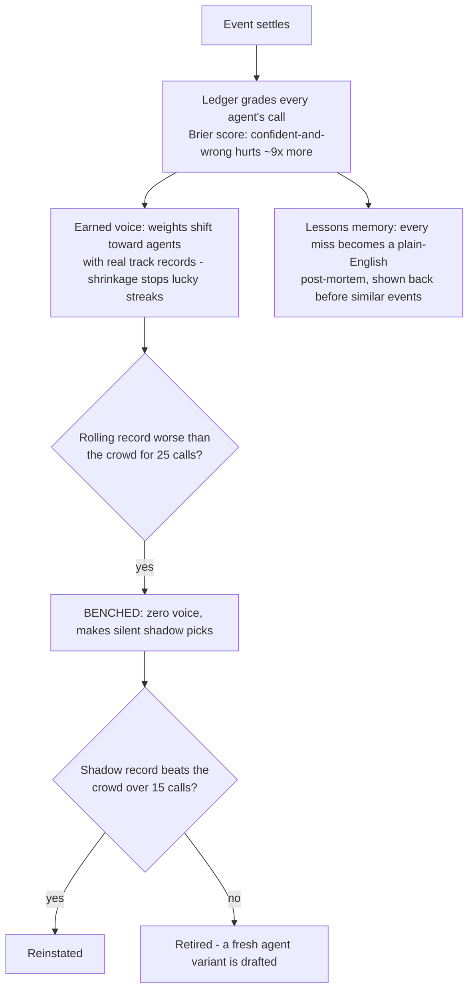

# Agamotto — Architecture

Agamotto is a crowd of AI forecasters that **simulates futures**. Instead of
asking one model "who wins?", it builds a crowd of different forecasters, has
each one imagine how the event could play out, reads a probability off all
those simulated futures, and then — the part most projects skip — **grades
itself against reality and real market prices**, with pass/fail rules written
down before any results exist.

Everything below is plain English on purpose. If a section needs jargon to
sound impressive, it's hiding something.

---

## The big picture



One sentence per box, left to right: adapters and dropped-in evidence feed the
crowd; the crowd simulates futures and settles on a number; the calibration
layer corrects its known biases; picks go to a paper ledger; every settled
event grades every agent; the grades move voice weights, bench the busts, and
write lessons; and all of it flows to a public dashboard that reads the same
ledger the gates read.

## The core loop, step by step

1. **An event shows up** (a game tonight, a market closing next week). The
   sport adapter turns raw stats into a plain **stat-sheet**: recent form,
   rest days, matchup history. The ingest layer attaches any **evidence
   cards** whose timestamps say the crowd is allowed to see them.
2. **The crowd forms.** Two ways to build it (both supported, measured
   head-to-head):
   - **Persona mode** — one model plays N distinct characters: the stats
     nerd, the narrative fan, the sharp-money watcher, the contrarian, the
     oddsmaker, the insider.
   - **Ensemble mode** — N *different model families*, each shown a
     *different slice* of the evidence (one gets news, one gets base rates,
     one gets price history), combined with a trimmed mean. Different brains
     plus different information beats one brain in costumes.
3. **Each agent sees futures.** In *vote mode* an agent returns one
   probability with a reason. In *simulate mode* it imagines the event
   playing out K times — short scenario rollouts — and its probability is
   the share of its own futures where the outcome happens. A 25-agent crowd
   at K=5 holds **125 simulated futures per event**.
4. **Optional deliberation.** One round where agents see each other's
   arguments and may update. Exactly one round, and it's an experiment arm —
   the backtest measures whether deliberation helps or hurts.
5. **Consensus + doubt.** The crowd's futures collapse to one probability;
   how much the agents disagree becomes the confidence number.
6. **Calibration.** A simple logistic layer, trained only on the past,
   corrects the crowd's known lean (e.g. chronic overconfidence). No
   transformers — at this data size that would be memorizing, not learning.
7. **The pick.** Only if the calibrated number differs from the market price
   by more than fees + a buffer does a paper pick go in the ledger, sized by
   fractional Kelly. No edge, no pick.
8. **The what-if (god's-eye).** Inject a fact — "star player is OUT" — and
   the futures re-run with that fact forced true. The dashboard animates the
   futures tree re-growing.

## The learning loop (how it gets better)

The underlying models never change. What learns is everything around them,
and every settled event teaches it:



Two hard rules keep the learning honest:

- **Walk-forward only.** Weights, lessons, benchings, and roster changes used
  on event N were learned strictly from events settled *before* N. The
  machine never gets to peek.
- **Learning is itself on trial.** "Adaptive weights + bench" vs "frozen equal
  weights" is a measured experiment. If the discipline system doesn't beat
  not-having-it, the report says so and it ships turned off.

## Leakage controls (why the backtest can be trusted)

Backtesting an LLM on past events has a dirty secret: the model may already
know how they ended. Agamotto treats that as a measured threat, not a hope:

- **The masker** strips every identity from historical stat-sheets (teams
  become "Team A / Team B", exact dates become "mid-season (January)").
- **The re-ID probe** then attacks our own mask: show models 100 masked games
  and ask them to name the teams. The re-identification rate is **published
  whatever it is**, and if it crosses the pre-registered line, the masked
  backtest is demoted to calibration-training only.
- **Post-cutoff scoring** is the gold standard: accuracy claims rest on
  events dated *after* the model's documented training cutoff — futures the
  model cannot have memorized.
- **Time-stamped evidence.** Every evidence card carries a timestamp, and the
  replayer only shows agents cards dated before the event.

## Evaluation (the part nobody ships)

Every claim runs through pre-registered gates (see `GATES.md`, written before
any results existed): enough sample size; beat the **market closing price**;
beat a **boring logistic baseline** on the same features (else the crowd is
expensive theater); survive a shuffled-labels luck test; survive fees and
spread; have enough market depth to matter. The backtest also answers, as
measured head-to-head experiments:

- persona crowd vs model ensemble vs one strong model prompted once
- vote mode vs simulate mode
- deliberation on vs off
- learning on vs off
- small crowd vs big crowd (does headcount even help, or only diversity?)

Fail a gate and the published verdict says so, plainly. A clean documented
"no" is a real result.

## The face — knaves.ai

A static site, and deliberately dumb: it renders JSON exported by
`report.py`, which reads the same ledger the gates read. The dashboard
*cannot* show a rosier number than the report.

- **Front door — the Multiverse Map:** tonight's events as branching futures
  trees. Branch thickness = share of futures that agree; the leading
  storyline glows; the what-if chip re-grows the tree live.
- **The War Room:** the consensus dial vs the market price, the agent
  constellation (dots grow with earned voice), the lessons feed, and the
  bench — suspended agents shown dimmed with their shadow records.
- **The Receipts:** gate lights (pass/fail, verbatim), calibration curve,
  track record, every pick with its story.
- **Theme:** "Immortal Weapon" — black `#0a0806`, gold chrome
  `#d9a13b→#f5c542`, crimson ember energy `#c22030→#ff9d2e`, ivory text
  `#efe6d8`.

## Repo map

```
agamotto/
├── config.py        # every dial in one file: crowd size, K futures, models,
│                    #   deliberation, sample size, hard $ budget cap
├── engine/          # personas.py, ensemble.py, swarm.py, learn.py,
│                    #   memory.py, calibrate.py, whatif.py
├── adapters/        # one file per domain (nba.py first) - stats in,
│                    #   stat-sheets out; knows nothing about agents
├── ingest.py        # evidence/ drop folder + auto news -> time-stamped cards
├── masker.py        # the anonymizer + the re-ID probe that attacks it
├── markets/         # verified closing prices (closes.py)
├── baseline.py      # the boring logistic control model
├── backtest.py      # replay + Brier/CLV scoring + the experiment arms
├── jointable.py     # results x closes join, with a quarantine file
├── verdict_m0.py    # applies the pre-registered gates
├── ledger.py        # paper picks + grading
├── report.py        # REPORT.md + the JSON the dashboard reads
└── run.py           # one live cycle (future: hourly in CI)
```

Boundary rules: the **engine never knows what a rebound is** (stat-sheets in,
probabilities out), the **adapter never knows what a persona is**. A new
domain is one new adapter file. Scaling up is a config change, never a
rewrite.

## Design principles

- **Paper-first.** The system makes and grades its own calls; a human places
  any real bet, and only after every gate passes.
- **Pre-registered honesty.** Pass/fail rules are locked before results
  exist; verdicts are published either way.
- **Walk-forward everything.** Nothing learned from the future, ever.
- **Determinism.** One seed (`14000605`) everywhere; any run reproduces
  exactly. Every model call is cached; re-runs are free.
- **Hard budget caps.** The engine counts tokens and halts at the cap. The
  cap decides how far anything scales — not enthusiasm.
- **Quarantine, never guess.** Odd data goes to a quarantine file with a
  reason. Missing votes are dropped and counted, never fabricated.
- **Plain English.** Comments, docstrings, output, and this document.

## Status

Milestone 0 (in progress): measure the mask leak, build the verified
closing-price table, and issue the pre-registered GO/NO-GO before a single
line of engine code. Full plan: `docs/superpowers/plans/`. Design record:
`docs/superpowers/specs/`.
